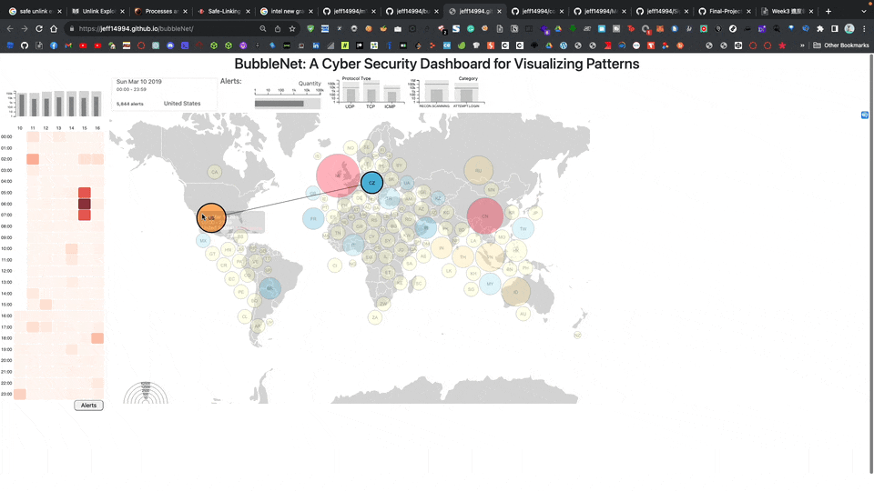

# Project: BubbleNet: A Cyber Security Dashboard for Visualizing Patterns
Detect and defend against DDoS/DoS attacks in real-time. Automate network packet analysis to easily spot anomalies, without the technical hassle.

## Demo


## Try it out!
[BubbleNet Dashboard to visualize attack patterns](https://jeff14994.github.io/bubbleNet/)

## Why doing this project? 
The emergence of the internet has led to a substantial increase in network crimes such as DDoS and DoS attacks. Network analysts faced difficulties in manually analyzing a large volume of network packets to detect anomalies and identify attack patterns due to their complexity and volume. Existing solutions were limited and required technical expertise, making them time-consuming and resource-intensive.

## My contributions
As a part of my project at Arizona State University, I was assigned the task of developing a visualization tool called BubbleNet to help the blue team identify and target internet attack patterns more effectively and efficiently. This involved creating and integrating several visualization components and hosting the BubbleNet application.

To meet this goal, I implemented a heat map and a bar chart that displayed the number of attacks across different time slots and the detailed breakdown of attacks by date and country, respectively. I also developed a tooltip feature in the heat map for users to view specific details like the date, time, and number of alerts by hovering over a time slot. I integrated interactivity components between the heatmap and bubble map and between the heatmap and time alerts. Moreover, I created an animation feature that updated all the bubbles when users clicked a time slot on the heat map. I also ensured the accessibility of the application by hosting it on my `GitHub domain`. This involved attempting to implement a `Responsive Web Design (RWD)` to enhance user experience on mobile phones, although this proved challenging due to the large number of bubbles. Additionally, I created a poster using Keynote to provide a comprehensive overview of the BubbleNet system and its components.

The BubbleNet system was able to provide an intuitive and user-friendly way for network analysts to identify outliers in a day by selecting a single country on the heat map. It also enabled users to easily identify the most severe attacks occurring during the day and compare and contrast attack patterns. As a result, network analysts could identify anomalies in network packets more efficiently, thus reducing their workload. The implementation of the BubbleNet project provided a comprehensive and powerful tool for detecting and analyzing network attacks.

## Before running

1. Download **data.csv** [here](https://drive.google.com/drive/folders/1A7mhwt3q0j-wioahDO9U7WP9yxtWDAWn?usp=sharing) and place it under `frontend/data`.
2. ```
   cd frontend
   python3 -m http.server
   ```
## Team Members:

Yu-Chuan Hung, yhung17@asu.edu, 1219439611<br>
Anrui Xiao, axiao3@asu.edu, 1217052876<br>
Jiahui Gao, jgao76@asu.edu, 1221030200<br>
Truxten Cook, tcook11@asu.edu, 1215525454<br>
Yu-Hsien Tu, yuhsien1@asu.edu, 1222290303<br>
Zain Jakwani, zjakwani@asu.edu, 1219121137<br>
